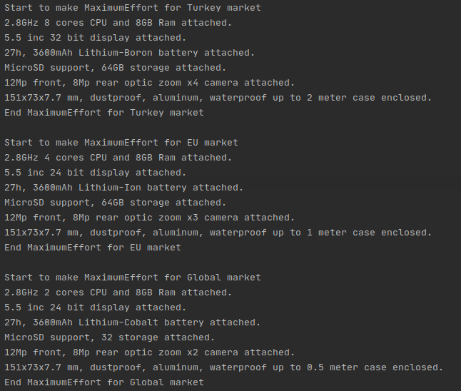
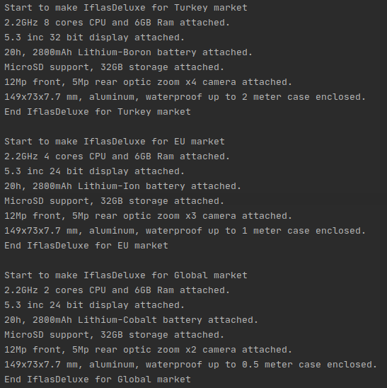
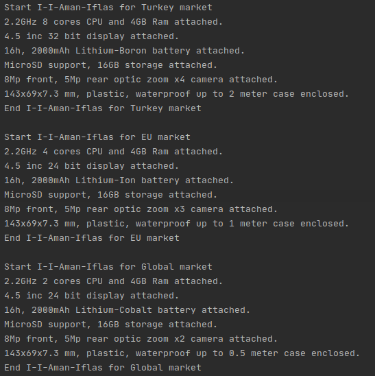

# Abstract Factory Pattern
In this example, a software requirement that controls the production of a phone manufacturer is set up. The company has three phone models with different components.

Table of phone models and components:
|Model name|Display size|Battery capacity|CPU & Ram size|Storage|Camera resolution|Case|
|---|---|---|---|---|---|---|
|MaximumEffort|5.5 inches|27h, 3600mAh|2.8GHz, 8GB| MicroSD support, 64GB|12Mp front, 8Mp rear|151x73x7.7 mm dustproof, waterproof, aluminum|
|IflasDeluxe|5.3 inches|20h, 2800mAh|2.2GHz, 6GB| MicroSD support, 32GB|12Mp front, 5Mp rear|149x73x7.7 mm waterproof, aluminum|
|I-I-Aman-Iflas|4.5 inches|16h, 2000mAh|2.2GHz, 4GB| MicroSD support, 16GB|8Mp front, 5Mp rear|143x69x7.3 mm waterproof, plastic|

However, the company plans to sell the same phone model in different markets by changing some of its features. For example, the processor of the phone will be sold in Turkey will have 8 cores. The processor of the phones to be sold in Europe will be 4 cores, and the processor of the phones in the global market will be 2 cores.

Table of phone customizations by market:
|Market|Color depth|Battery type|CPU cores|Max supported storage|Camera zoom|Waterproof guarantee|
|---|---|---|---|---|---|---|
|Turkey|32bit|Lithium-Boron|8 cores|Max 128GB|4X optic|Up to 2m|
|Europe|24bit|Lithium-Ion|4 cores|Max 64GB|3X optic|Up to 1m|
|Global|24bit|Lithium-Cobalt|2 cores|Max 32GB|2X optic|Up to 50cm|

The abstract factory pattern was used to solve the complexity that required changes in 3 different models and some features of each model in each market.

## Running Footage

