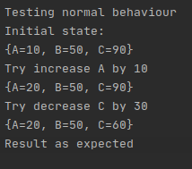
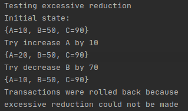
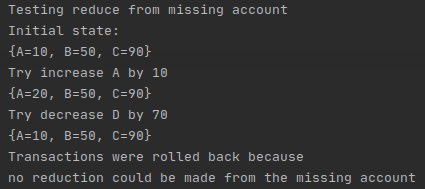
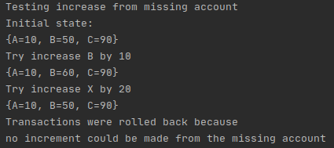

# Command Pattern
For this example, a software that adds and decreases money on the accounts in a bank has been designed. The desired work should be like a whole. For example, if one of the transactions fails, previous transactions should be canceled, that is, the accounts should be brought back to the initial stage.

The command pattern was used to meet these requirements. Records were kept in memory for each transaction performed. In case one of the transactions could not be done, the accounts were brought to their initial state by applying the reverse of the transactions made from the records.

## Running Footage

