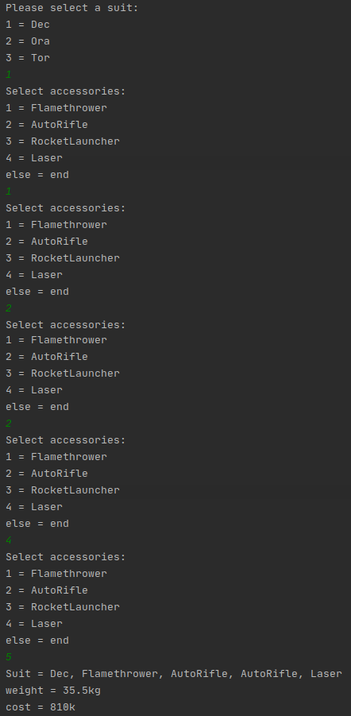

# Decorator Pattern
According to the scenario, a suit manufacturer company requires a program where its customers can choose their suit and accessories. 

There are several types of suit and accessory types. Each suit and accessory has its cost and weight. Customer should be able to choose one suit and several accessories for herself/himself and finally see the total cost and weight.

Using the Decorator design pattern, it was possible to dynamically collect the suit and accessories selections made by the customer in one object at runtime.

Table of cost and weight of suit types:
| Suit Type | Cost | Weight |
| --- | --- | --- |
|Dec | 500k | 25kg |
|Ora | 1500k | 30kg |
|Tor | 5000k | 50kg |

Table of cost and weight of accesory types:
| Accesory Type | Cost | Weight |
| --- | --- | --- |
|Flamethrower | 50k | 2kg |
|Auto Rifle | 30k | 1.5kg |
|Rocket Launcher | 150k | 7.5kg |
|Laser | 200k | 5.5kg |

## Usage
The program works with a text-based interface. First asks the customer to choose suit type. It then offers the accessories. The customer can select accessories again as long as she/he makes the valid selection. If she/he wants to finalize the selection, an invalid selection ends the presentation and the suit and accessories made at the end are written on the screen with their total cost and weight.

## Running Footage

