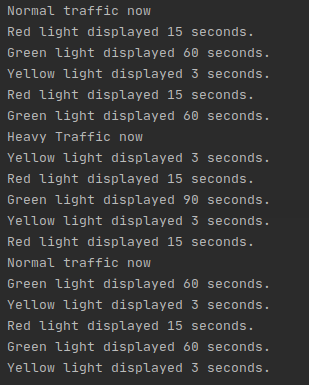

# Observer and State Pattern
In this setup, a traffic light whose green light duration can change according to the traffic density is sampled. The lights of the traffic light are written according to the state pattern. 

The traffic light starts with the red light first and the red light takes 15 seconds. After the red light, the green light is on and 60 seconds in normal traffic and 90 seconds in heavy traffic. After the green light, the yellow light is on for 3 seconds. After the yellow light it is red again and so it works in cycle.

HiTch class measures the traffic density and reports to traffic lights. The relationship between the HiTech class and the TrafficLight class was constructed in accordance with the observer pattern. The HiTech class assumed the observable role, the TrafficLight class the observer role. 

## Running Footage
