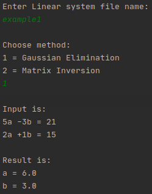
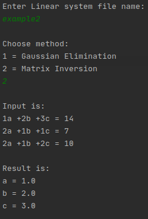
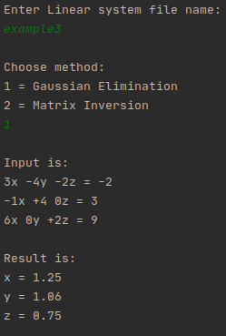

# Strategy Pattern
Sample program written for strategy design pattern. As a scenario, a program that can solve a linear equation system with several different solving methods is required. 

A program was created that reads the linear equation system from a file and can apply solutions with two different methods, and find variables up to two digits after point.

An interface was specified for the solution method. Then two solution method classes (Matrix Inversion and Gaussian Eleminaion) were written that implement this interface. 

Thanks to the strategy design pattern, the user can dynamically choose the solution method according to his/her choice at runtime. Moreover, if a new solution method had to be added later, the requirements could be met with little effort: adding a class that implements the solution method interface and a small change in the main class.

## Usage
The program works with a text-based interface. First, it asks the user for the name of the file containing the linear equation system. it then asks him/her to choose one of the Matrix Inversion or Gaussian Eleminaion solution methods. As a result, it writes the linear equation system first and then the values of the variables on the screen.

## Input File Layout
* Each equation must be on separate lines
* The order of the variables must be the same in each equation
* Even if the coefficient of a variable is zero, it should be written in its order in the equation (look at last footage)

## Running footage

